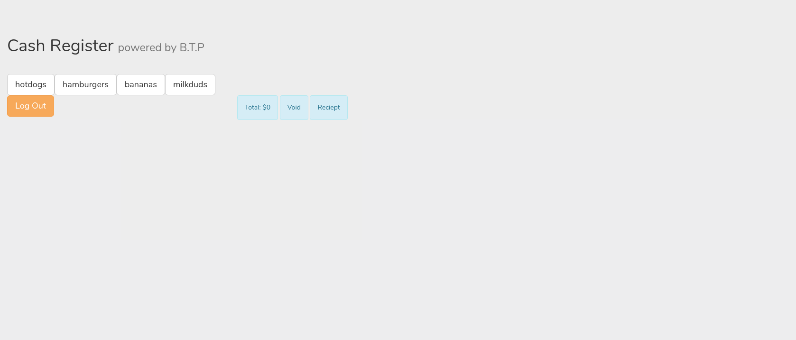
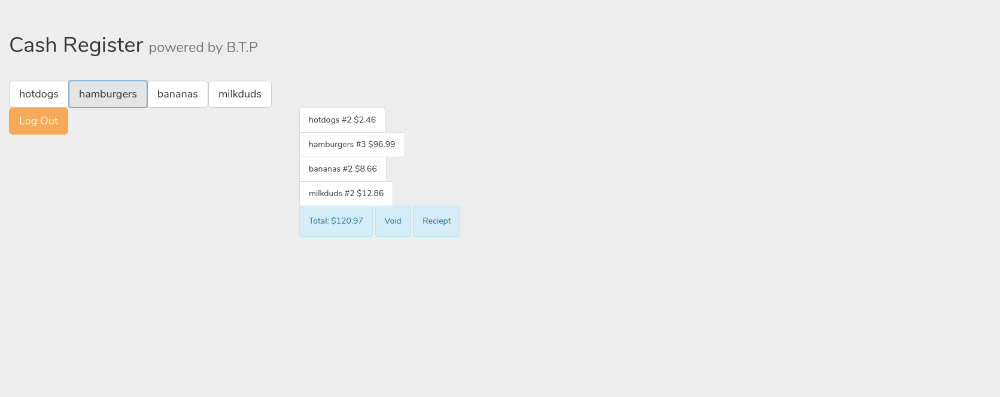
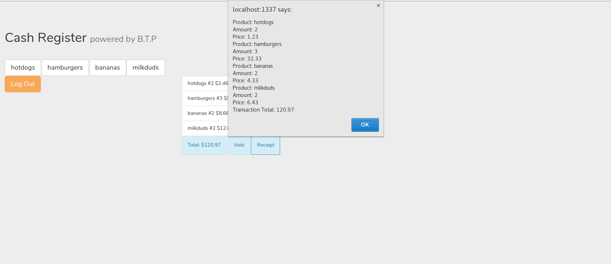

# User Manual

### Database containing the tables: Tony
* till_buttons: Holds information about the buttons for the till buttonID, label, invID, and price
* till_users: Holds all users that can come in contact with the till containing a username and password
* trans_id: Keeps track of the current transaction id(this is updated for every transaction that is completed)
* transactionSummary:A summary of the transactions in the archive_items table.
* archive_items: Keeps track of items sold via sale button.
* current_trans: Holds information about the current items about to be sold.

### How to use our Point-of-Sales system
1. Logging In: The user is able to log in with the appropriate username and password as seen in Figure 1.

2. Once you are logged in you are able to add items to your cart

3. You have multiple options once you have items in your cart. You can Checkout by clicking on the Total(this is our sale functionality), you can also choose to void your current cart by clicking on the Void button. Or you can choose to log out using the Log Out option.

4. Lastly you can check your receipt by clicking the Receipt button.

# API appendix
* `/user?username=` - Gets password for the given `username` argument
* `/buttons` - Gets button contents from sql table: `till_buttons`
* `/click?id=` - Updates the amount of the specified item and returns the contents of the table: `current_trans`
* `/sale?currentUser=` - Completes the current transaction for the `currentUser` and copies the `current_trans` contents to `archive_items` (`current_trans` table is truncated after the copying)
* `/void` - Aborts the current transaction
* `/delete?id=` - Deletes the specified item from the sql table: `current_trans`, and returns the contents of the table
